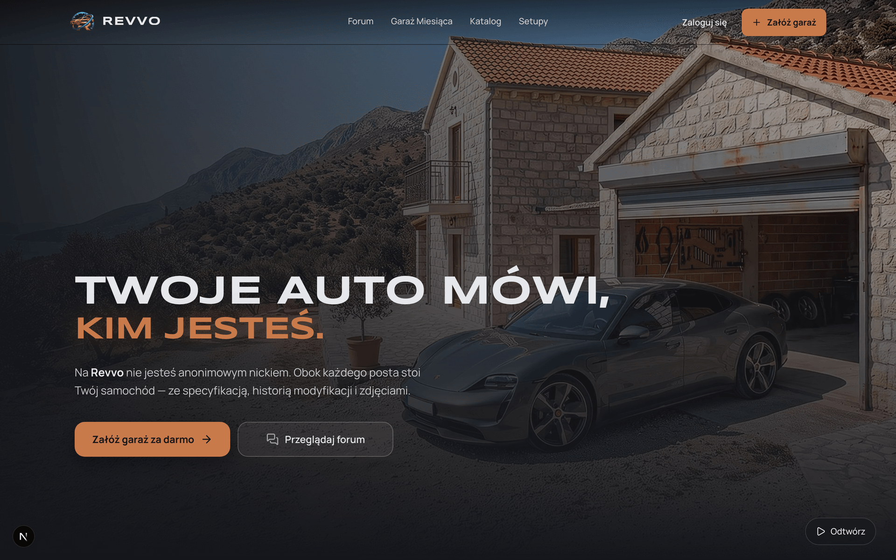
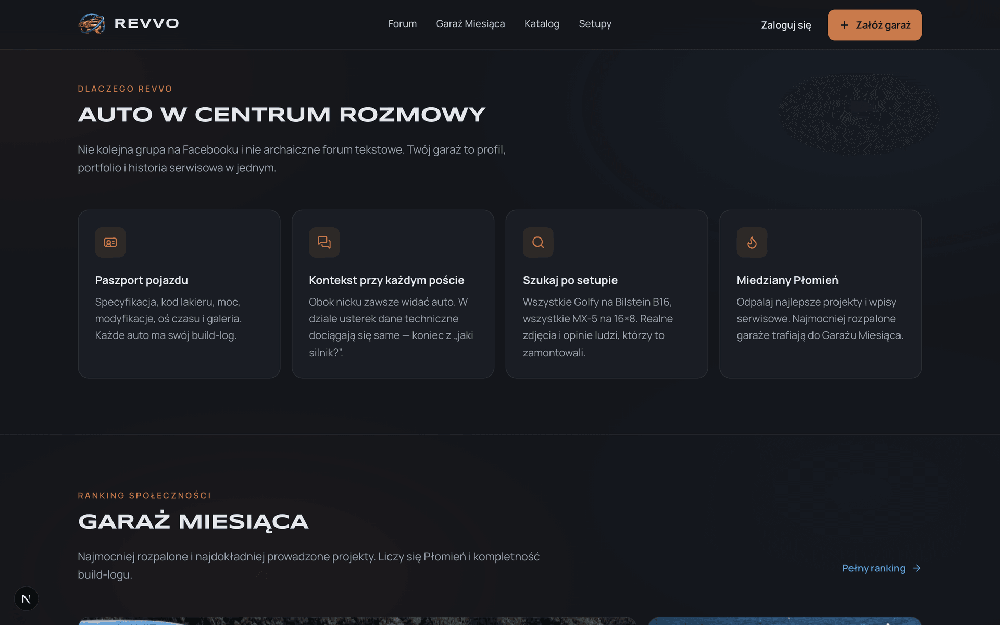
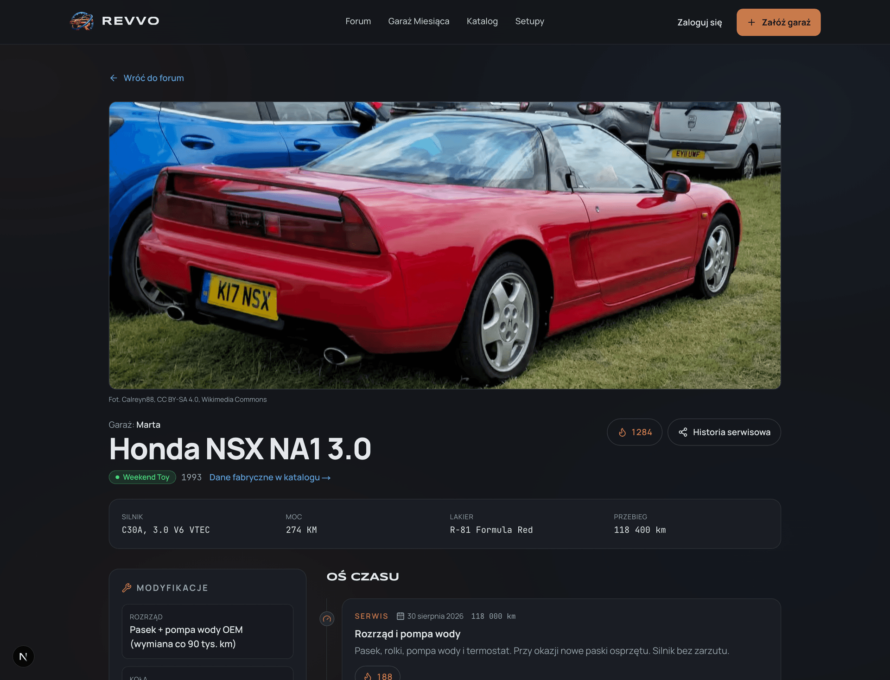
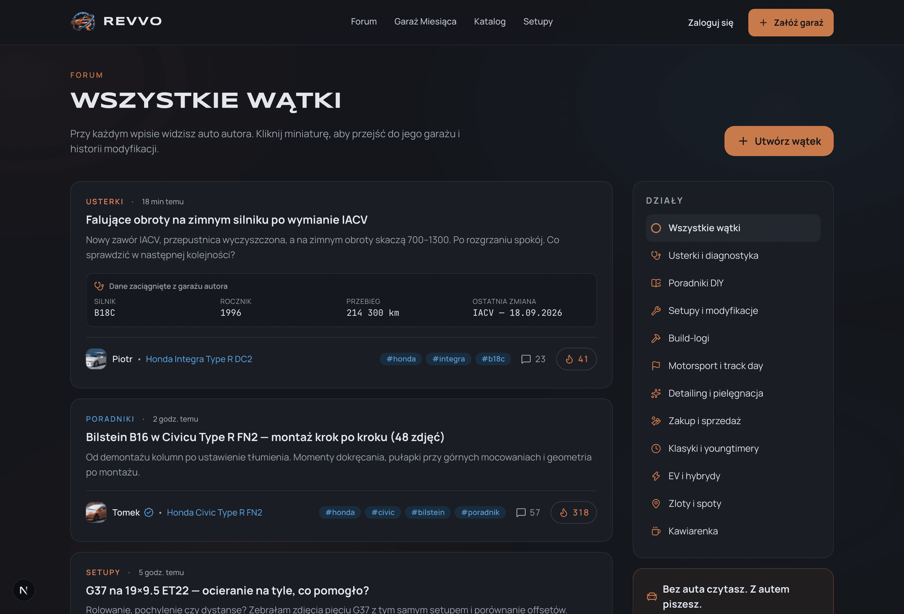
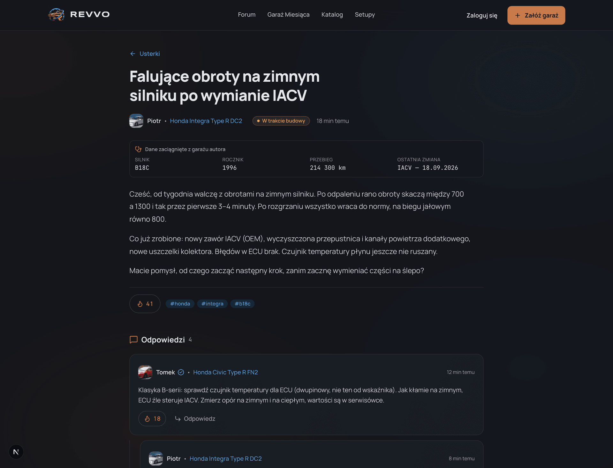
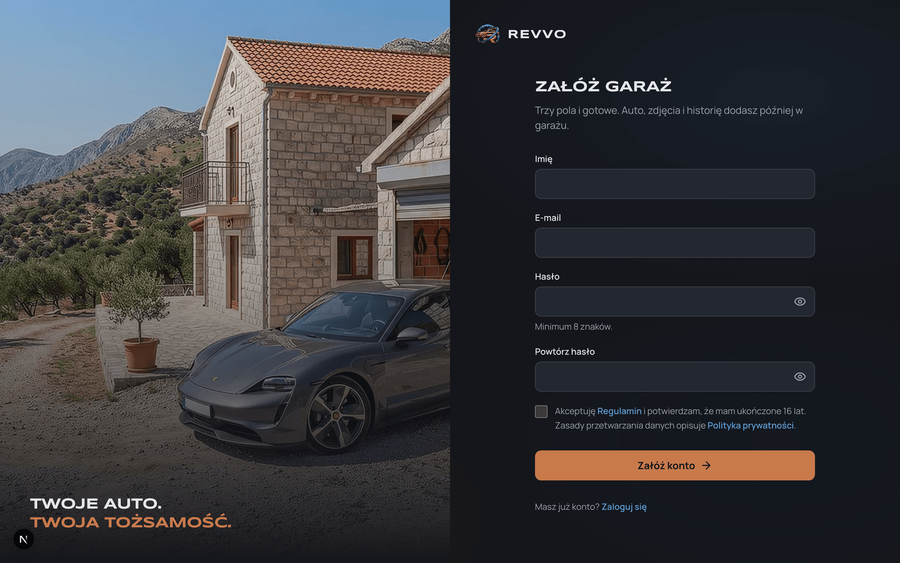
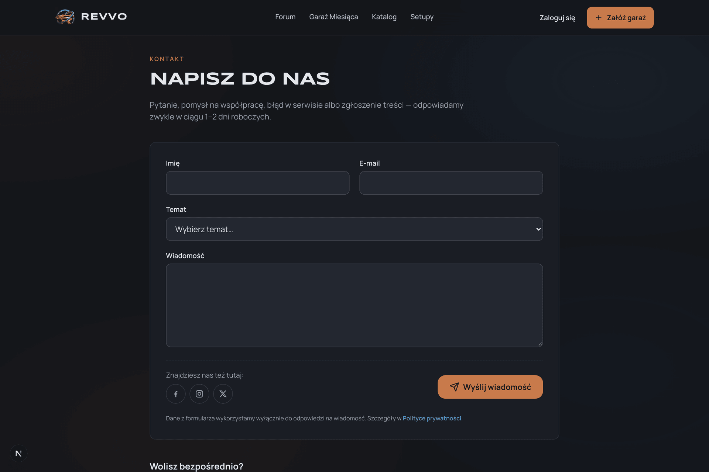

<div align="center">


### Forum motoryzacyjne nowej generacji oparte o Wirtualny Garaż

*„Twoje auto mówi, kim jesteś.”*

[](https://nextjs.org/)
[](https://react.dev/)
[](https://www.typescriptlang.org/)
[](https://tailwindcss.com/)
[](https://www.postgresql.org/)
[](https://orm.drizzle.team/)
[](https://www.cloudflare.com/products/r2/)

[Opis projektu](#-o-projekcie) • [Zrzuty ekranu](#-podgląd-aplikacji) • [Kluczowe filary](#-kluczowe-filary) • [Architektura](#-architektura-i-stos-technologiczny) • [Szybki start](#-szybki-start) • [Struktura katalogów](#-struktura-katalogów)

</div>

---

## 📌 O projekcie

**REVVO** to nowoczesna platforma społecznościowa dla entuzjastów motoryzacji, która rozwiązuje największe bolączki tradycyjnych forów dyskusyjnych i grup na Facebooku. 

W tradycyjnych mediach społecznościowych wiedza ginie w chaosie, a każda dyskusja techniczna zaczyna się od niekończących się pytań: *„Jaki silnik? Jaki rocznik? Co było modzone?”*.

W **REVVO** centrum tożsamości użytkownika jest **samochód (lub kolekcja aut)**, a nie anonimowy awatar. Każdy profil to interaktywny **Wirtualny Garaż** z pełnym paszportem pojazdu, osią czasu modyfikacji i rzetelną historią serwisową.

### 🌟 Dlaczego REVVO?

1. **Koniec z anonimowością techniczną** — obok każdego posta i komentarza widoczna jest plakietka pojazdu autora z bezpośrednim odnośnikiem do jego specyfikacji.
2. **Automatyczny kontekst w usterkach** — tworząc wątek w dziale diagnostyki, system automatycznie dołącza snapshot Twojego pojazdu (kod silnika, rocznik, przebieg, ostatnie modyfikacje).
3. **Baza wiedzy oparta o setupy** — szukasz jak leży felga 18×8.5 ET35 albo jak sprawdza się gwint Bilstein B16? Wyszukujesz po konkretnych częściach i oglądasz realne zdjęcia oraz opinie właścicieli.
4. **Zasada zaangażowania** — czytać może każdy, ale żeby pisać i tworzyć społeczność, musisz dodać co najmniej jedno auto do swojego garażu.

---

## 📸 Podgląd aplikacji

### 1. Strona główna z interaktywnym wideo i efektem głębi
*Hero z dynamicznym tłem wideo wyjeżdżającego z garażu auta oraz autorskim efektem głębi (Depth Effect).*



---

### 2. Filary platformy i Garaż Miesiąca
*Wyróżniki platformy: Paszport pojazdu, Kontekst wypowiedzi, Wyszukiwarka setupów oraz system grywalizacji Miedziany Płomień z rankingiem najlepszych projektów.*



---

### 3. Wirtualny Garaż — Paszport i Build-Log pojazdu
*Kompleksowa karta auta: parametry fabryczne zintegrowane z katalogiem, status (Daily, W trakcie budowy, Weekend Toy, Projekt na tor), lista modyfikacji, oś czasu modyfikacji/serwisów i licznik Miedzianych Płomieni.*



---

### 4. Forum dyskusyjne z kategoryzacją
*11 wyspecjalizowanych działów tematycznych. Na liście wątków każdy autor oznaczony jest swoim samochodem z garażu.*



---

### 5. Widok wątku z automatycznym snapshotem auta
*Wątek w dziale diagnostycznym z automatycznie zaciągniętą kartą techniczną auta autora oraz drzewiastą dyskusją.*



---

### 6. Dołącz do społeczności — Rejestracja
*Szybki, minimalistyczny onboarding skupiony wokół pasji motoryzacyjnej.*



---

### 7. Kontakt i pomoc
*Dedykowany formularz kontaktowy z wyborem tematów i integracją wsparcia.*



---

## ⚡ Kluczowe filary

### 🚗 Wirtualny Garaż (Cyfrowy Paszport & Build-Log)
- **Karta pojazdu:** kod lakieru, silnik, fabryczna moc, modyfikacje pogrupowane w kategorie (silnik, zawieszenie, wydech, koła, wnętrze).
- **Oś czasu (Timeline):** chronologiczny rejestr modyfikacji, napraw, wizyt na torze i sesji zdjęciowych wraz z przebiegiem.
- **Statusy projektu:**
  - 🔵 **Daily** — auto do codziennej jazdy
  - 🟠 **W trakcie budowy** — aktywny projekt garażowy
  - 🟢 **Weekend Toy** — auto weekendowe / klasyk
  - 🔴 **Projekt na tor** — maszyna przygotowana pod track day / motorsport
- **Publiczny link historii serwisowej:** transparentne potwierdzenie historii modyfikacji i dbałości o samochód przy ewentualnej sprzedaży.

### 💬 Forum z natywnym kontekstem technicznym
- **11 wyspecjalizowanych działów:**
  - *Usterki i diagnostyka* (dołącza snapshot auta)
  - *Poradniki DIY* (manuale krok po kroku ze zdjęciami)
  - *Setupy i modyfikacje* (co pasuje, co ociera i jak jeździ)
  - *Build-logi* (dzienniki projektów od zakupu po finał)
  - *Motorsport i track day* (czasy okrążeń, przygotowanie torowe)
  - *Detailing i pielęgnacja* (korekty, powłoki, PPF)
  - *Zakup i sprzedaż* (poradniki zakupowe, weryfikacja)
  - *Klasyki i youngtimery*, *EV i hybrydy*, *Zloty i spoty*, *Kawiarenka*.
- **Drzewiaste komentarze:** czytelna hierarchia odpowiedzi z podglądem auta każdego komentującego.

### 🔥 Miedziany Płomień i Garaż Miesiąca
- Unikalny system uznania społeczności (`#C87A4B` Copper Flame).
- Możliwość „odpalenia płomienia” dla całego projektu lub konkretnego, imponującego wpisu serwisowego na osi czasu.
- Automatyczny algorytm wyłaniający **Garaż Miesiąca** na stronie głównej na podstawie jakości wpisów i zaangażowania społeczności.

---

## 🛠 Architektura i stos technologiczny

| Warstwa | Technologia | Opis |
|---|---|---|
| **Frontend Framework** | **Next.js 16 (App Router)** | Najnowszy Next.js z Cache Components, Turbopack, SSR/SSG dla optymalnego SEO wątków i garaży |
| **Biblioteka UI** | **React 19** | Nowoczesne komponenty serwerowe (RSC) i klienckie, React `<ViewTransition>` |
| **Styling & Design System** | **Tailwind CSS v4** | Autorska paleta REVVO v2 (grafit `#14161B`, miedź `#C87A4B`, kobalt `#5B9BD5`), pełna zgodność z WCAG AA |
| **Typografia** | **Syncopate + Manrope + JetBrains Mono** | Wyrazisty krój display dla nagłówków, czytelny sans dla treści oraz monospace dla danych technicznych |
| **Ikony** | **Lucide React** | Spójny zestaw wektorowy |
| **Backend & API** | **Next.js Server Actions + Route Handlers** | Architektura domenowa (`src/server/...`), przygotowana pod modułową rozbudowę |
| **Baza danych** | **PostgreSQL** | Relacyjna baza danych obsługująca relacje katalogowe, komentarze drzewiaste i indeksy modyfikacji |
| **ORM & Migracje** | **Drizzle ORM** | Type-safe schemat bazy, migracje SQL przez `drizzle-kit` |
| **Storage multimediów** | **Cloudflare R2** | Magazyn S3-compatible o zerowych kosztach egressu dla zdjęć aut i załączników |
| **Przetwarzanie obrazów** | **Sharp** | Kompresja do nowoczesnych formatów WebP/AVIF z automatycznym generowaniem responsywnych wariantów |
| **Zabezpieczenia & Antyspam** | **Cloudflare Turnstile** | Niewidoczna dla użytkownika weryfikacja CAPTCHA przy formularzach |

---

## 📁 Struktura katalogów

```text
Revvo/
├── docs/                     # Dokumentacja projektu oraz zrzuty ekranu
│   └── screenshots/          # Wygenerowane zrzuty ekranu interfejsu (Retina)
├── logo/                     # Oficjalne assety identyfikacji wizualnej (wektory SVG, PNG, WebP)
├── package.json              # Główne skróty npm do uruchamiania poleceń w projekcie
└── web/                      # Główna aplikacja Next.js
    ├── .env.example          # Wzorzec bezpiecznych zmiennych środowiskowych
    ├── drizzle/              # Migracje bazy danych Drizzle ORM
    ├── drizzle.config.ts     # Konfiguracja Drizzle ORM
    ├── next.config.ts        # Konfiguracja Next.js 16 (Cache Components, images, remote patterns)
    ├── scripts/              # Skrypty importu danych (seed, katalog car2db, pobieranie zdjęć)
    └── src/
        ├── app/              # Routing App Router (strona główna, forum, garaże, katalog, auth)
        ├── components/       # Reużywalne komponenty UI (nawigacja, karty, odtwarzacz wideo, plakietki)
        ├── lib/              # Narzędzia pomocnicze, typy danych, mock data
        └── server/           # Logika backendowa (połączenie z bazą db, zapytania katalogu, kategorie)
```

---

## 🚀 Szybki start

### Wymagania wstępne
- **Node.js** w wersji `v20.x` lub nowszej (rekomendowany `v22+`)
- **npm**, **pnpm** lub **yarn**
- Działająca instancja bazy danych **PostgreSQL** (lokalnie, w Dockerze lub usłudze chmurowej typu Neon/Supabase)

### 1. Klonowanie repozytorium
```bash
git clone https://github.com/twoja-organizacja/revvo.git
cd revvo
```

### 2. Konfiguracja zmiennych środowiskowych
Przejdź do katalogu aplikacji webowej i utwórz plik `.env` na podstawie przygotowanego szablonu:
```bash
cp web/.env.example web/.env
```
Następnie uzupełnij plik `web/.env` swoimi danymi (m.in. dane połączenia z bazą PostgreSQL, klucze Cloudflare R2 i losowy ciąg dla `AUTH_SECRET`).

### 3. Instalacja zależności
Zainstaluj zależności aplikacji:
```bash
cd web
npm install
```

### 4. Baza danych: migracje i seedowanie danych
Zastosuj przygotowane migracje tabel w PostgreSQL i zasiej bazę podstawowym katalogiem aut oraz kategoriami forum:
```bash
npm run db:migrate
npm run db:seed
```

Źródłowy katalog aut (`baza-danych/`), oryginały wideo (`background/`), zdjęcia źródłowe (`content/`) i design system (`design-system/`) są tylko lokalne i nie trafiają do repozytorium. `npm run db:seed` wymaga katalogu `baza-danych/` obok folderu `web/`.

> **Wskazówka:** Możesz uruchomić Drizzle Studio w przeglądarce, aby podejrzeć strukturę i zawartość bazy danych:
> ```bash
> npm run db:studio
> ```

### 5. Uruchomienie serwera deweloperskiego
Uruchom serwer developerski Next.js (z katalogu głównego lub z `web/`):
```bash
# Z katalogu głównego projektu:
npm run dev

# Lub bezpośrednio z katalogu web/:
cd web && npm run dev
```

Aplikacja będzie dostępna pod adresem: **[http://localhost:3000](http://localhost:3000)**.

---

## 📜 Dostępne skrypty npm

| Polecenie (w katalogu `web/` lub z roota) | Opis |
|---|---|
| `npm run dev` | Uruchamia serwer developerski Next.js (Turbopack) na porcie 3000 |
| `npm run build` | Buduje zoptymalizowaną wersję produkcyjną aplikacji |
| `npm run start` | Uruchamia zbudowaną aplikację w trybie produkcyjnym |
| `npm run lint` | Sprawdza poprawność kodu przy użyciu ESLint |
| `npm run db:generate` | Generuje nową migrację SQL po modyfikacjach w `schema.ts` |
| `npm run db:migrate` | Aplikuje oczekujące migracje do bazy PostgreSQL |
| `npm run db:seed` | Wypełnia bazę danych katalogiem modeli oraz działami forum |
| `npm run db:seed:demo` | Dodaje 4 konta demo z autami i osią czasu (Marta, Piotr, Tomek, Kasia), można powtarzać |
| `npm run db:studio` | Otwiera graficzny interfejs Drizzle Studio do przeglądania danych |
| `npm run test:e2e` | Uruchamia testy end-to-end (Playwright, desktop i mobile) |

---

## 🧪 Testy e2e

Zestaw Playwright w `web/e2e/` (pliki `*.e2e.ts`), uruchamiany w dwóch widokach: desktop 1440×900 i telefon (Pixel 7). Sprawdza:

- każdą podstronę: status 200, jeden H1, `lang="pl"`, meta title i description, brak poziomego scrolla, brak błędów w konsoli,
- konta: rejestrację (walidacja, duplikat e-maila, link potwierdzający), logowanie z powrotem pod adres `next`, ciasteczko HttpOnly, wylogowanie, blokadę po 5 błędnych hasłach, reset hasła (link działa raz), zmianę imienia i hasła, usunięcie konta,
- garaż: zdjęcia (wgrywanie, okładka, galeria, odrzucanie podrobionych i za małych plików), kreator auta z katalogu, auto wpisane ręcznie, walidację, edycję, auto główne, usuwanie, ochronę przed edycją cudzego auta,
- forum, katalog, formularz kontaktu i SEO (unikalne tytuły, Open Graph, `robots.txt`, `sitemap.xml`, `favicon.ico`, strona 404).

Testy działają na osobnym serwerze (port 3100) z testowymi kluczami Cloudflare Turnstile i e-mailami zapisywanymi do `web/.mailbox/` zamiast wysyłki przez Resend. Najprościej uruchomić go z build produkcyjnym w katalogu `.next-e2e`:

```bash
cd web
export NEXT_DIST_DIR=.next-e2e STORAGE_DRIVER=local EMAIL_TRANSPORT=file NEXT_PUBLIC_APP_URL=http://localhost:3100 NEXT_PUBLIC_TURNSTILE_SITE_KEY=1x00000000000000000000AA TURNSTILE_SECRET_KEY=1x0000000000000000000000000000000AA
npm run build && npm run start -- --port 3100
```

W drugim terminalu:

```bash
npm run test:e2e
```

Bez działającego serwera Playwright sam uruchomi `next dev` na porcie 3100 z tymi samymi zmiennymi (wolniej). Konta testowe (`e2e-…@example.com`) są usuwane po zakończeniu testów. Wymagana baza z katalogiem i danymi demo (`npm run db:seed` i `npm run db:seed:demo`). Przy pierwszym uruchomieniu: `npx --prefix web playwright install chromium`.

---

## 🔒 Bezpieczeństwo i prywatność danych

- Wszelkie prywatne dane konfiguracyjne, tokeny sesji i klucze API przechowywane są w `.env` i są **wykluczone z repozytorium** poprzez reguły `.gitignore`.
- Repozytorium zawiera wyłącznie bezpieczny szablon konfiguracyjny `web/.env.example`.
- Hasła użytkowników są hashowane algorytmem **Argon2id**. Sesje są zapisane w bazie (w ciasteczku `HttpOnly`, `Secure`, `SameSite=Lax` trafia tylko losowy token, w bazie jego skrót SHA-256), ważne 30 dni od ostatniej wizyty.
- Rejestracja i reset hasła są chronione przez Cloudflare Turnstile, pułapkę na boty i limity prób. Logowanie blokuje się po 5 błędnych hasłach w 15 minut.
- Każda zmiana auta sprawdza na serwerze, czy auto należy do zalogowanej osoby. Nagłówki bezpieczeństwa (CSP, HSTS, `X-Content-Type-Options`, `Referrer-Policy`, `Permissions-Policy`, `frame-ancestors`) ustawia `next.config.ts`.
- Raporty testów (`playwright-report/`, `test-results/`, `coverage/`) oraz lokalne logi asystentów są odfiltrowane przez `.gitignore`. Zestaw testów e2e (`web/e2e/*.e2e.ts`) zostaje w repozytorium.

---

## 📄 Licencja

Kod projektu jest udostępniony na licencji MIT. Pełna treść w pliku [LICENSE](LICENSE).

Licencja MIT nie obejmuje nazwy i logo Revvo (`logo/`, `web/public/brand/`), wideo z tła strony ani zdjęć aut z Wikimedia Commons, które mają własne licencje (CC BY, CC BY-SA, CC0) zapisane w bazie przy każdym zdjęciu.

---

<div align="center">

Stworzone z pasją do motoryzacji i nowoczesnego web developmentu.

**REVVO © 2026 Szymon Kaczmarczyk** · licencja MIT

</div>
